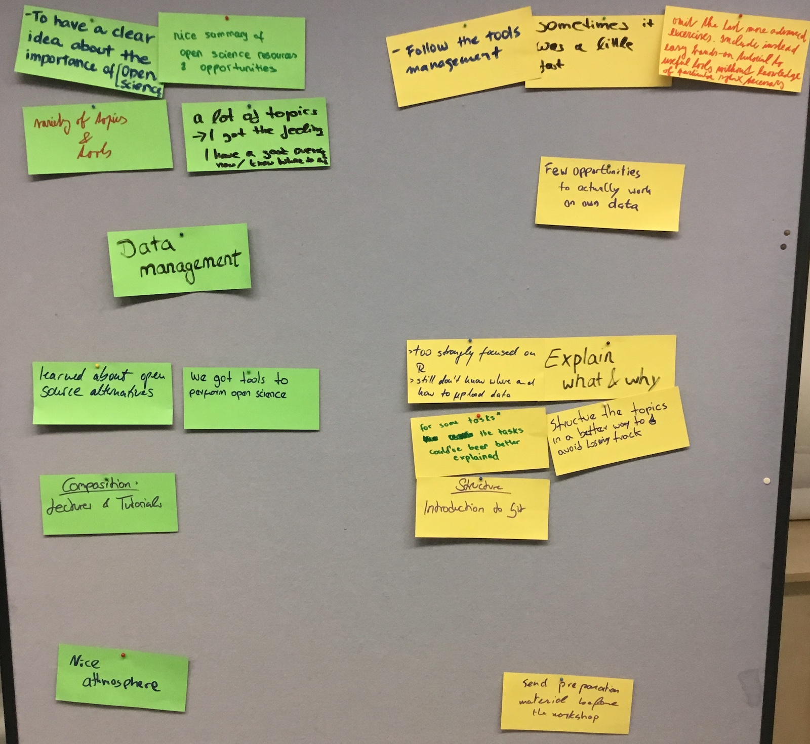

Open science and research data management: a workshop review
====================

With the digitization of the scientific workflow, researchers are faced with new challenges: While Open FAIR data is already a standard they have to comply with (and for good reasons see video 1), transparency and reproducibility of the research are only starting to being recognized as good scientific practices. We think it is possible for researchers to achieve **better science, in less time**. It goes through better data management (video 2), designing one's science workflow to achieve maximal sharing of the outputs. We therefore designed a specific Open Science and Research Data Management workshop, and performed our first run in November.  

video 1: open data is the new standard.
<iframe src="https://widgets.figshare.com/articles/7379942/embed?show_title=0" width="568" height="426" frameborder="0"></iframe>

After a warm up and an introduction of (open) science principles and values, we worked on the definition of open data and its importance in the current research ecosystem. Emphasizing how collaboration is at the center of open science, I introduced gitlab, and students were asked to populate a website (I had previously prepared) with their personal information. We then looked carefully at research data management principles, working on each student project, defining the raw and primary data, the data flow and the main objective of their studies. Students had then 1 minute to explain their experiments to the others, in an elevator pitch format. In the second part of the day, we dig into the questions of digital data organisation, file naming and proper spreadsheet structure, in order to create machine readable outputs. Students were asked to write a data management plan into the gitlab (feedback was given on the next day). At the end of the day, students were asking for more information about tools for open science, as well as complaining about gitlab use.

The second day started by an introduction to collaborative working and why open science is not much about tools, but about getting people to work together. We then discussed what where official good and bad scientific practices, also relating them to data handling problems we discussed on the first day. I introduced open access and creative commons licensing before we moved to the reproducibility crisis and what open science can do about it:  open data, material, methods and open source analysis as necessary steps toward reproducible results and we saw how to achieve it with little efforts (data repositories, FAIR principles, protocols.io, RRID, programming languages). It was then time to give a proper introduction into version control and git. The last afternoon was busy trying to get Rstudio working with gitlab and creating a reproducible analysis from data given to the students. 

The nine PhD students enjoyed the workshop, particularly the nice atmosphere, the good balance between lectures and practical exercises and the "nice summary of open science resources and opportunities" (fig.1). But, as expected from the first run, there is room for improvement. Some students found it a bit too fast sometimes and had difficulties following the workshop structure. The use of a website to introduce collaborative working in gitlab should be ameliorated or abandonned and the importance of the online presence should be made clear. A strategy involving ORCID (as it is developped in the open science MOOC) might be more relevant. Using online walkthrough to link Rstudio and gitlab prior to the workshop would be an efficient way to prepare the students for the course.
Last but not least, the focus on research data management was appreciated by early PhD students, while late PhD's had the impression it was too late for them. 

Learning from this first round, we are working to offer an even better workshop in 2019, in order to best deliver the skills and tools necessary for scientists to easily and efficiently embrace Open Science and FAIR Data Management. 

video 2: RDM saves time and efforts.
<iframe src="https://widgets.figshare.com/articles/7163396/embed?show_title=0" width="568" height="426" frameborder="0"></iframe>

Dr. Julien Colomb, trainer at access2perspectives

