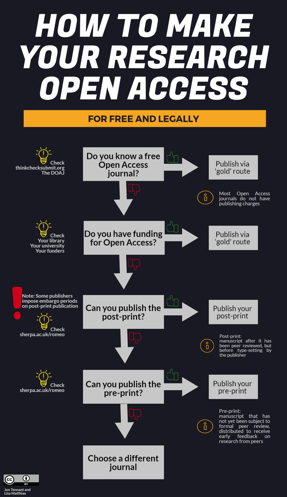

# Copyright distribution Licenses

## Copyright?

Berne Convention (1976) makes copyright automatic:

- If not noted otherwise, any document is copyrighted and only his author can determine whether, and under what conditions, this original work may be used by others. 

- If you want to make it possible and free to re-use your work without having to grant it, you should apply a different license to it.

## Creative commons

by [Foter](https://foter.com), CC_BY_SA
 

## Why not NC, SA, ND?

- CC-BY license is the only real open access license.

    - I can not use CC-BY-NC documents here (teaching for money).
    - I cannot use CC-BY-SA files in a document I want to keep rights to.
    - Why would anyone ever use a ND license ?

- For data, use CC0:

    - People will cite you if they technically can
    - You are not limiting inclusion of your data in project needing CC0

## license for code

Creative Commons licenses are not to be used for code (you do not want to be liable if the code is destructing things).

equivalents (see [https://choosealicense.com](https://choosealicense.com)):

> - MIT for CC-BY
> - GNU GPLv3  for CC-BY-SA

## Let's add licenses to your folder on the website !
- Which one?
- How to do that?

# Open access

## video introduction

https://www.youtube.com/watch?time_continue=503&v=L5rVH1KGBCY

## details of the video

- License:  Creative Commons Attribution license (reuse allowed)
- Not easily accessible (no download button)
- No raw data

## What do publishers do ?

- organisation of peer review
- copy editing editing (xml version creation)
- distribution
- provide prestige
- subscription negotiations and lobbying

- create the paywall
- create a way to pay to pass the paywall

## Business

costs.

    - 400-600 € for publishing a paper
    - multiplied by the rejection factor

price.

    - what people will be ready to pay and
    - prestige has no price (every journal is a monopoly)
    
## Colors of open access

- Green: paper copy in repositories (publisher copy after embargo or/and author manuscripts)
- APC Gold: authors pay a fee ("article processing charge") to publish with a permissive license
- Diamond: money is found somewhere else (grants, societies,donations,...)

- Bronze: free to read but no license
- Black: illegal copies available

If a journal has both OA and non-OA article, it is called hybrid.

## Gold OA may not be cheaper

- It is a monopoly industry: prices do not go along costs
- The pressure to publish in "high impact journals" did not change

## The bright side

- Funders are pushing for OA
- DORA: limiting the importance of journal brands

## The industry is changing fast

- PloS was a huge commercial success = to be copied
- New business models are developed
- Open peer review is coming

## eventually, we will achieve full, free OA

Because YOU will not care about journal prestige!

## What you should do

# My hopes for a fast change

Decoupling peer review and publication could make costs more transparent, and accepted papers will not have to pay for rejected ones.

This might change the incentives on the long term.