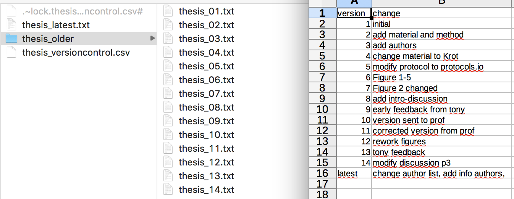

```{r setup, include=FALSE}
knitr::opts_chunk$set(echo = FALSE)
```


##Versioning: the problem

- …
- thesis-final
- thesis-final2,thesis-final3, thesis-final4, thesis-final4-corr
- thesis-final-final
- …
- thesis-final-final-corr_Prof-3-submitted-rev2 ?

## Version control: manual solution

- Increasing numbers: 01-99, or 001-999 or ISO date (end or beginning of file name)
- Version history file: log of changes 
- Also possible: all old version in a sub-folder, keep only last version in the main folder.

## Results

<center></center>

## Automation via Git

- "git commit"" is like
    - adding a snapshot of file in an invisible folder
    - writing a comment in the version history
- Result:
    - Only latest version visible
    - All version saved (although less accessible)
    - Version history, with messages
    
- In addition:
    - Deleted files are still there somewhere !
    - only changes are saved in the snapshot -> need less storage space <br> !! work with text files only, not binaries (.csv, .txt, .md but not .docs, .xlsx, .jpg,… files)

## git commit, principle

<center></center>

## git commit, in Rstudio

<center></center>

## Version history

<center></center>

## Using git in practice

- Command lines for nerds !
- Rstudio (github desktop,…), for creation, commits and simple stuff
- Git specific software (Sourcetree, tortoise,…) for more complex processes (merge, complex history,…)
- Problems -> google error message -> stack overflow solution (mostly via git commands, shell button on Rstudio)