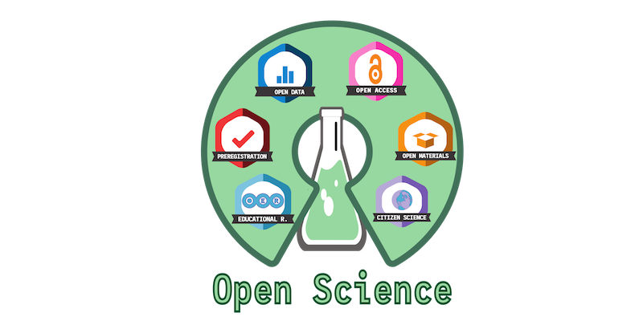

```{r setup, include=FALSE}
knitr::opts_chunk$set(echo = FALSE)
```

# Presentation 

- your name
- one sentence about your scientific project
- one card tell about why you choose to be a scientist

## Open science


<center></center>


  
 
 


# Foreword
## Workshop timing

- 15 min breaks at 10:45 and 15h
- lunch 12h30 to 13h30
- end at 16:45
- Dinner tonite ?


## Code of conduct

- Be supportive, collaborative, kind, and generous with feedback
- No exclusionary language or microaggressions (beware of jokes)
- React if you see unfit behavior
- Please don’t say: “Comment X wasn’t sexist!”, apologize and move on.

# Question ?

# open collaboration: 

- Version control and git: the basics of “git commit”
- Using Gitlab / GitHub

##Versioning: the problem

- …
- thesis-final
- thesis-final2,thesis-final3, thesis-final4, thesis-final4-corr
- thesis-final-final
- …
- thesis-final-final-corr_Prof-3-submitted-rev2 ?

## Version control: manual solution

- Increasing numbers: 01-99, or 001-999 or ISO date (end or beginning of file name)
- Version history file: log of changes 
- Also possible: all old version in a sub-folder, keep only last version in the main folder.

## Results

<center></center>


Open keynote (Git.key)