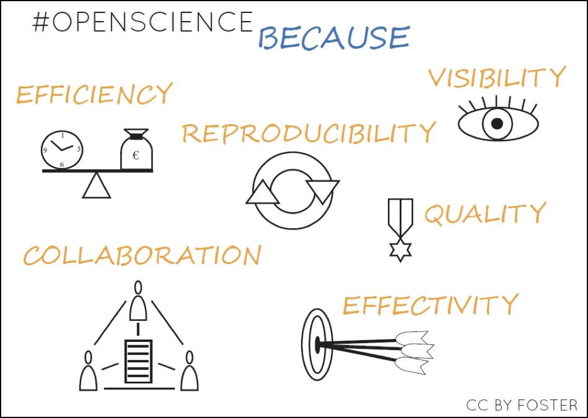

```{r setup, include=FALSE}
knitr::opts_chunk$set(echo = FALSE)
```

# Presentation 

- your name
- one sentence about your scientific project
- one card tell about why you choose to be a scientist


##  Open science definition

Open Science is the practice of science in such a way that others can collaborate and contribute, where research data, lab notes and other research processes are freely available, under terms that enable reuse, redistribution and reproduction of the research and its underlying data and methods. 

[FOSTER, Open Science Definition: https://www.fosteropenscience.eu/foster-taxonomy/open-science-definition]

## Open science is diverse


<center></center>

## Why open science

<center></center>

## Open data is coming !

>- Funders ask for it
>- Journals ask for it
>- Universities ask for it

Get ready for it !
 
 


# Foreword
## Workshop timing

- 15 min breaks at 10:45 and 15h
- lunch 12h30 to 13h30
- end at 16:45
- Dinner tonite ?


## Code of conduct

- Be supportive, collaborative, kind, and generous with feedback
- No exclusionary language or microaggressions (beware of jokes)
- React if you see unfit behavior
- Please don’t say: “Comment X wasn’t sexist!”, apologize and move on.
- pacman rule whie talking in a circle

# Question ?

# open collaboration: 

> - [Version control and git, the basics of “git commit”](gitbasics.html)
> - Using Gitlab / GitHub

