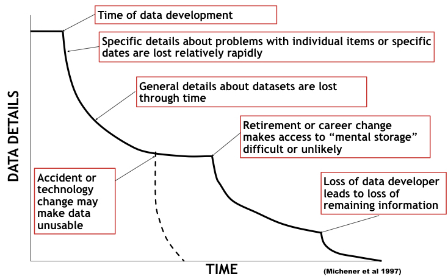

## What do we need to reproduce the analysis?

- data
- detailed documentation:
    - What was done
    - What software was used (version number)
    - What dependencies of that software

## Not as straightforward as it seems !

- data filtering
- error in manual handling of the data (copy paste actions, sort,...)
- different software (versions) have different outputs
- ...

## Main take home message: document, document, document! 


<center></center>

## First things to consider

1. Document all your analysis and test whether your documentation is enough.
2. Get rid of excel for data analysis
3. I said do not use excel !

## No excel, then what ?

- R or/and python
- matlab: not open source
- SPSS and others: less reproducible, but can work with good documentation.
- Stencila

## Code Comments: basic rule

> - comments comes before the code
> - if necessary comments can come in the code, on the same line

```{r, results ='asis',tidy = TRUE}
#{r, results ='asis',tidy = TRUE} # tidy = TRUE makes code better readable

##----------------- SHOWING COMMENTS: ------------------------------------
## this type of lines are useful to find code parts, note the 2 #

## this little code will add 2 to x 
x = 2 # this is the  initial  value of x
y <- x+2
# y = x+x # this line is some non-executed code, somewhat useful for tests or when developing code...
#let's look at the result:
print (y) 

```

## Code Comments: advanced rule

> - prefer clear code to comments 
> - use filenames rules for variables naming

```{r, results ='asis',tidy = TRUE}
##----------------- SHOWING COMMENTS advanced: ------------------------------------

## calculating and printing our output value

input_value = 2
output_value = input_value + 2

print (output_value) 

```

## Dependencies {.smaller}


```{r}
sessionInfo()

```

